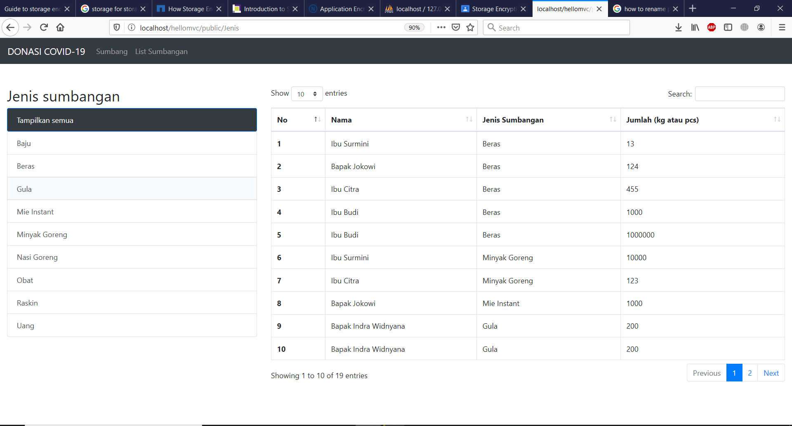
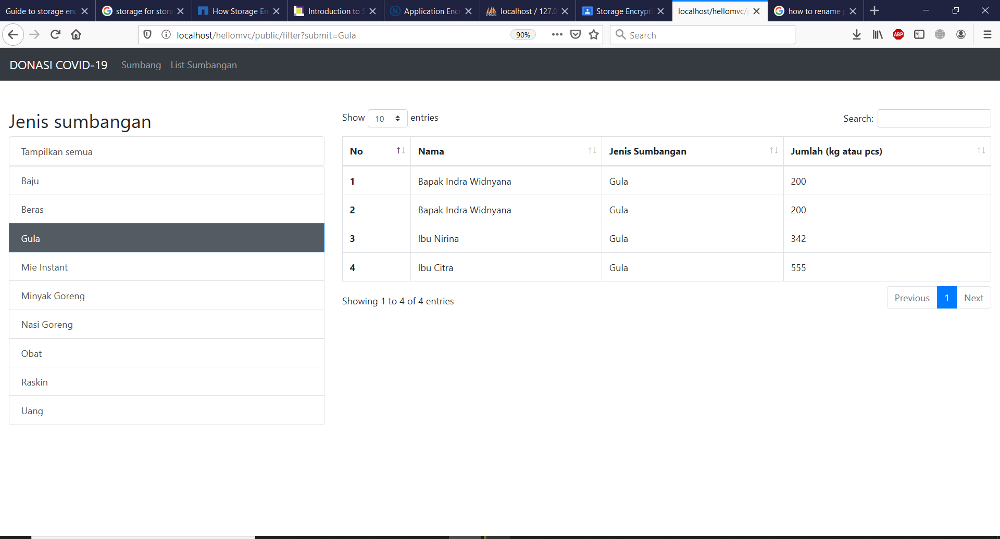
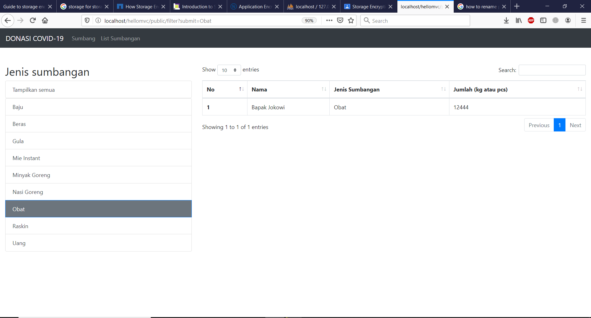
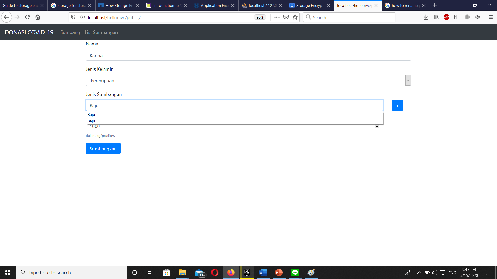
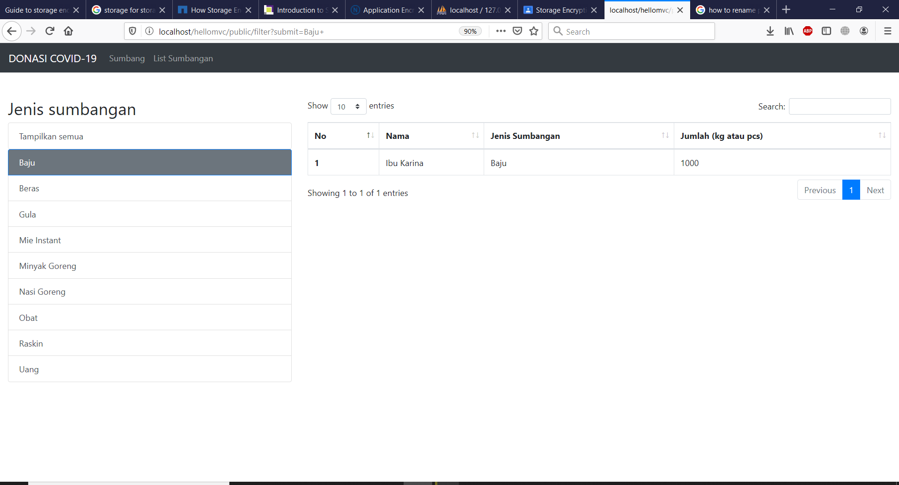

# Dokumentasi Singkat Tugas EAS Pemrograman Integratif

## Nama : I Gede Pradhana Indra Widnyana
## NRP    : 05311840000031
##  Dept : Teknologi Informasi

### ----------------------------------------------------------------------------------
### Note* : Untuk folder public saat didownload, jika file .htaccess tidak dapat didownload atau error maka saya berikan backup berupa file .rar dengan nama public.rar (untuk antisipasi)
### ----------------------------------------------------------------------------------
Untuk pengaplikasian saya menggunakan folder yang sama dengan tugas-tugas sebelumnya yakni foler hellomvc , namun saya tambahkan beberapa file sesuai dengan ketentuan yang saya buat diatas **(Dokumentasi_ETS_Pemrograman Integratif_I Gede Pradhana Indra Widnyana_05311840000031.docx)** ,seperti **sumbangan.php, rekap.html, jenis.php,** mengedit (modifikasi) dengan menambahkan isi dari **Base.html dan index.html,** serta dengan memodifikasi dengan menambahkan route pada **index.php** dan **home.php**

- **Home.php** yang berisi tentang form awal pada website COVID-19 saya. **(template warna dan form menggunakan bootstrap)**
- **index.html** yang sebagian besar isinya untuk tampilan dari form dan website itu sendiri baik dari setiap row yang terdapat pada form pengisian sumbangan, dll.
- **index.php** yang isinya terkait route dari semua yang ada pada hellomvc saya, termasuk tugas sebelum-sebelumnya. Untuk tugas EAS, saya cantumkan pada line 40-44 bahwa 3 route tersbut adalah route tambahan khusus untuk tugas EAS ini.
- **jenis.php** yang berfungsi untuk menampilkan semua sumbangan yang ada dengan memanggil fungsi pada file **rekap.html** baik itu untuk menampilkan semuanya ataupun menampilkan fungsi **filtering** saja
- **rekap.html** yang mengatur “tampilan” dari fitur list sumbangan yang sudah dibahas sebelumnya, terdapat juga fungsi **filtering** pada file **rekap.html** ini.
- **sumbangan.php** yang isinya tentang public static function (public function) **sejumlah 7** diantaranya **getName, setUser, isThere, setJS, setSumbangan, getSumbangan, getFilterSumbangan.** Semua fungsi tersebut digunakan untuk fetch data yang sudah ada dari database ke website **(seperti pada fitur list sumbangan)** dan menginput data dari website ke database.
-  **base.html** yang isinya hampir sama dengan tugas-tugas sebelumnya karena memang saya menggunakan folder yang sama, hanya saja yang membedakan adalah saya membuat navbar sesuai dengan website yaitu **Sumbang dan List Sumbangan, lalu setting judul website, dll** . **Pada file ini juga saya menginstall bootstrap untuk tampilan.**

## Untuk lebih jelasnya, penjelasan lengkap dapat dilihat di file "Dokumentasi_ETS_Pemrograman Integratif_I Gede Pradhana Indra Widnyana_05311840000031.docx"
### ----------------------------------------------------------------------------------
### Directory path pada : \htdocs\hellomvc\ ...
### ----------------------------------------------------------------------------------
### Dibawah ini adalah screenshot pada tampilan home (public) 

### ----------------------------------------------------------------------------------
### Dibawah ini adalah screenshot pada tampilan rekap sumbangan 

### ----------------------------------------------------------------------------------
### Dibawah ini adalah screenshot pada tampilan filter sumbangan berdasarkan jenis (contoh: gula dan obat) 

### ----------------------------------------------------------------------------------
### Dibawah ini adalah screenshot pada tampilan sumbang dan mencoba menginput data 

### ----------------------------------------------------------------------------------
### Dibawah ini adalah screenshot pada hasil input data yang dicoba sebelumnya

