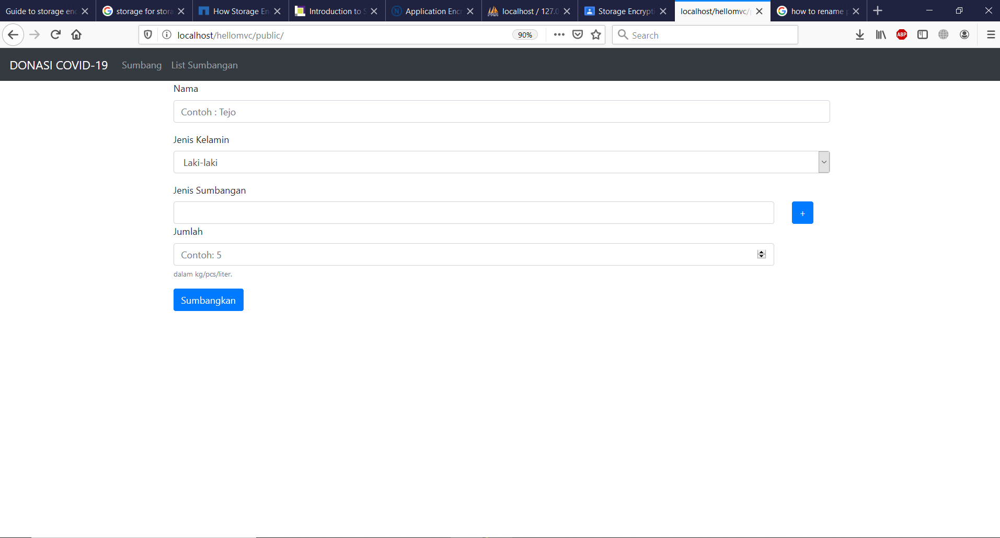
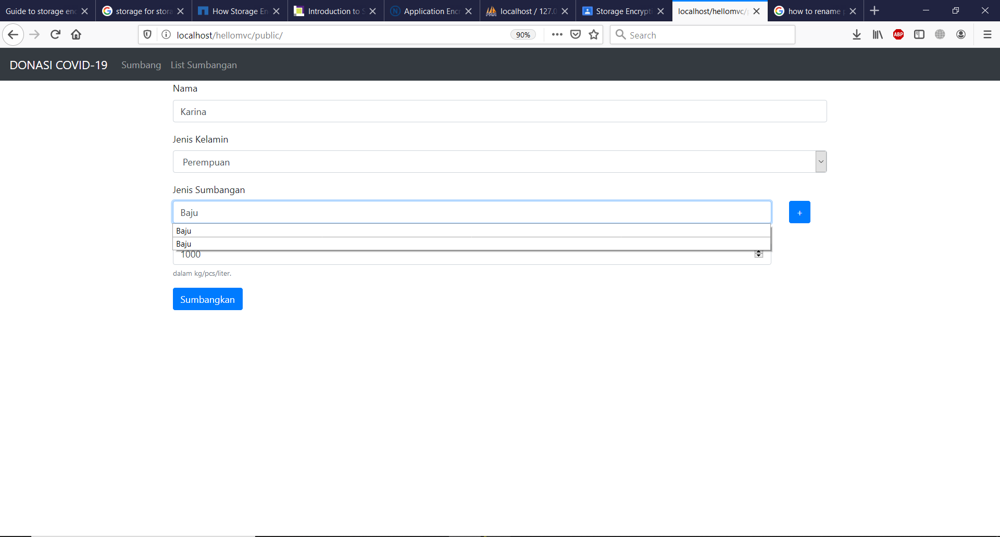

# Screenshot Tugas EAS Pemrograman Integratif

## Nama : I Gede Pradhana Indra Widnyana
## NRP    : 05311840000031
##  Dept : Teknologi Informasi

### ----------------------------------------------------------------------------------
## Untuk lebih jelasnya, penjelasan lengkap dapat dilihat di file "Dokumentasi_ETS_Pemrograman Integratif_I Gede Pradhana Indra Widnyana_05311840000031.docx"
### ----------------------------------------------------------------------------------
### Directory path pada : \htdocs\hellomvc\...
### ----------------------------------------------------------------------------------
### Dibawah ini adalah screenshot pada tampilan home (public) 

### ----------------------------------------------------------------------------------
### Dibawah ini adalah screenshot pada tampilan rekap sumbangan 

### ----------------------------------------------------------------------------------
### Dibawah ini adalah screenshot pada tampilan filter sumbangan berdasarkan jenis (contoh: gula dan obat) 

### ----------------------------------------------------------------------------------
### Dibawah ini adalah screenshot pada tampilan sumbang dan mencoba menginput data 

### ----------------------------------------------------------------------------------
### Dibawah ini adalah screenshot pada hasil input data yang dicoba sebelumnya

